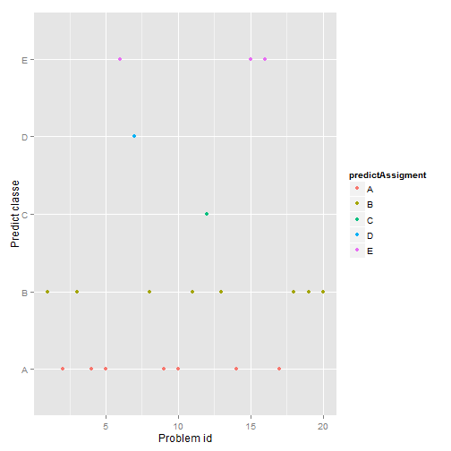

```
## Loading required package: lattice
## Loading required package: ggplot2
## randomForest 4.6-10
## Type rfNews() to see new features/changes/bug fixes.
```


A Machine Learning Model to Predict Self Movement 
=================================================

## Executive Summary
Using devices such as Jawbone Up, Nike FuelBand, and Fitbit it is now possible quantify self movement to improve health by finding patterns to predict successfully whether barbell lifts are done correctly.

The data was partitioned into an 60/40 (training/testing) cross-validation set. The training data was used to train a random forest, which produced an accuracy of 99% over the test data.

## Data Preparation


The process to prepare the data is:
* Load data into two raw datasets
* Remove missing data using caret nearZeroVar()
* Remove 'X' that is a sequence for each data row that might cause bias.
* At this point we have 52 predictors plus the outcome variable.

```
##  [1] "roll_belt"            "pitch_belt"           "yaw_belt"            
##  [4] "total_accel_belt"     "gyros_belt_x"         "gyros_belt_y"        
##  [7] "gyros_belt_z"         "accel_belt_x"         "accel_belt_y"        
## [10] "accel_belt_z"         "magnet_belt_x"        "magnet_belt_y"       
## [13] "magnet_belt_z"        "roll_arm"             "pitch_arm"           
## [16] "yaw_arm"              "total_accel_arm"      "gyros_arm_x"         
## [19] "gyros_arm_y"          "gyros_arm_z"          "accel_arm_x"         
## [22] "accel_arm_y"          "accel_arm_z"          "magnet_arm_x"        
## [25] "magnet_arm_y"         "magnet_arm_z"         "roll_dumbbell"       
## [28] "pitch_dumbbell"       "yaw_dumbbell"         "total_accel_dumbbell"
## [31] "gyros_dumbbell_x"     "gyros_dumbbell_y"     "gyros_dumbbell_z"    
## [34] "accel_dumbbell_x"     "accel_dumbbell_y"     "accel_dumbbell_z"    
## [37] "magnet_dumbbell_x"    "magnet_dumbbell_y"    "magnet_dumbbell_z"   
## [40] "roll_forearm"         "pitch_forearm"        "yaw_forearm"         
## [43] "total_accel_forearm"  "gyros_forearm_x"      "gyros_forearm_y"     
## [46] "gyros_forearm_z"      "accel_forearm_x"      "accel_forearm_y"     
## [49] "accel_forearm_z"      "magnet_forearm_x"     "magnet_forearm_y"    
## [52] "magnet_forearm_z"     "classe"
```

Now we are ready to partition the data by 60/40 ratio. This means 11776 samples to build our model, and 7846 testing data to validate it. 


---
## Feature and Model Selection
After evaluate several models using caret package in R like and evaluate the accuracy the results determine the random forest got the best accuracy (rf, 99%) compared with other models like k-nearest neighborhood (knn, 73%), bootstrapped random forest (rpart, 87%).

The Random Forest method takes longer but shows a well performance with an accuracy >99%. The in-sample error was very low with an OOB estimate of 0.85% and an accuracy of 99%.


```r
tc = trainControl(method = "cv", number = 10)
fit <- train(classe ~ ., data = training, method = "rf", trControl = tc)
fit$finalModel
```

```
## 
## Call:
##  randomForest(x = x, y = y, mtry = param$mtry) 
##                Type of random forest: classification
##                      Number of trees: 500
## No. of variables tried at each split: 2
## 
##         OOB estimate of  error rate: 0.84%
## Confusion matrix:
##      A    B    C    D    E class.error
## A 3345    3    0    0    0   0.0008961
## B   15 2259    5    0    0   0.0087758
## C    0   24 2028    2    0   0.0126582
## D    0    0   39 1888    3   0.0217617
## E    0    0    2    6 2157   0.0036952
```

## Cross Validation
The out-sample error is keeping the good performance with an accuracy of 99%.

```
## Confusion Matrix and Statistics
## 
##           Reference
## Prediction    A    B    C    D    E
##          A 2231    5    0    0    0
##          B    1 1510    4    0    0
##          C    0    3 1363   30    3
##          D    0    0    1 1256    4
##          E    0    0    0    0 1435
## 
## Overall Statistics
##                                         
##                Accuracy : 0.993         
##                  95% CI : (0.991, 0.995)
##     No Information Rate : 0.284         
##     P-Value [Acc > NIR] : <2e-16        
##                                         
##                   Kappa : 0.992         
##  Mcnemar's Test P-Value : NA            
## 
## Statistics by Class:
## 
##                      Class: A Class: B Class: C Class: D Class: E
## Sensitivity             1.000    0.995    0.996    0.977    0.995
## Specificity             0.999    0.999    0.994    0.999    1.000
## Pos Pred Value          0.998    0.997    0.974    0.996    1.000
## Neg Pred Value          1.000    0.999    0.999    0.995    0.999
## Prevalence              0.284    0.193    0.174    0.164    0.184
## Detection Rate          0.284    0.192    0.174    0.160    0.183
## Detection Prevalence    0.285    0.193    0.178    0.161    0.183
## Balanced Accuracy       0.999    0.997    0.995    0.988    0.998
```

## Variable Importance
This section use varImp() to determine what variables are important for the model.

```
## rf variable importance
## 
##   only 20 most important variables shown (out of 52)
## 
##                   Overall
## roll_belt           100.0
## yaw_belt             86.8
## magnet_dumbbell_z    73.6
## magnet_dumbbell_y    70.8
## pitch_forearm        67.3
## pitch_belt           67.0
## magnet_dumbbell_x    61.9
## roll_forearm         56.1
## accel_dumbbell_y     51.7
## accel_belt_z         51.4
## roll_dumbbell        47.8
## magnet_belt_z        47.6
## magnet_belt_y        46.5
## accel_dumbbell_z     40.6
## roll_arm             39.3
## accel_forearm_x      36.2
## gyros_belt_z         35.0
## accel_dumbbell_x     34.4
## accel_arm_x          32.9
## yaw_dumbbell         32.5
```

## Prediction Assigment
This is the prediction and export of the Prediction Assignment that is submitted in the Coursera.

```r
predictAssigment <- predict(fit, newdata = rawValidation)
qplot(rawValidation$problem_id, predictAssigment, colour = predictAssigment, 
    xlab = "Problem id", ylab = "Predict classe", height = "100")
```

 

```r

# Convert data frame to character vector
answers <- data.frame(lapply(predictAssigment, as.character), stringsAsFactors = FALSE)

# Function to output validation set answers in submittable format
pml_write_files = function(x) {
    n = length(x)
    for (i in 1:n) {
        filename = paste0("problem_id_", i, ".txt")
        write.table(x[i], file = filename, quote = FALSE, row.names = FALSE, 
            col.names = FALSE)
    }
}

pml_write_files(answers)
```


