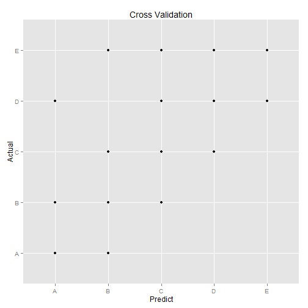

```
## Loading required package: lattice
## Loading required package: ggplot2
## randomForest 4.6-10
## Type rfNews() to see new features/changes/bug fixes.
```


A Machine Learning Model to Predict Self Movement 
=================================================

## Executive Summary
Using devices such as Jawbone Up, Nike FuelBand, and Fitbit it is now possible quantify self movement to improve health by finding patterns to predict successfully whether barbell lifts are done correctly.

## Data Preparation


The process to prepare the data is:
* Load data into two raw datasets
* Remove missing data using caret nearZeroVar()
* Remove 'X' that is a sequence for each data row that might cause bias.
* At this point we have 52 predictors plus the outcome variable.
Now we are ready to partition the data by 60/40 ratio to build our model.

```
## [1] "training"
```

```
## [1] 11776    53
```

```
## [1] "testing"
```

```
## [1] 7846   53
```

```
##  [1] "roll_belt"            "pitch_belt"           "yaw_belt"            
##  [4] "total_accel_belt"     "gyros_belt_x"         "gyros_belt_y"        
##  [7] "gyros_belt_z"         "accel_belt_x"         "accel_belt_y"        
## [10] "accel_belt_z"         "magnet_belt_x"        "magnet_belt_y"       
## [13] "magnet_belt_z"        "roll_arm"             "pitch_arm"           
## [16] "yaw_arm"              "total_accel_arm"      "gyros_arm_x"         
## [19] "gyros_arm_y"          "gyros_arm_z"          "accel_arm_x"         
## [22] "accel_arm_y"          "accel_arm_z"          "magnet_arm_x"        
## [25] "magnet_arm_y"         "magnet_arm_z"         "roll_dumbbell"       
## [28] "pitch_dumbbell"       "yaw_dumbbell"         "total_accel_dumbbell"
## [31] "gyros_dumbbell_x"     "gyros_dumbbell_y"     "gyros_dumbbell_z"    
## [34] "accel_dumbbell_x"     "accel_dumbbell_y"     "accel_dumbbell_z"    
## [37] "magnet_dumbbell_x"    "magnet_dumbbell_y"    "magnet_dumbbell_z"   
## [40] "roll_forearm"         "pitch_forearm"        "yaw_forearm"         
## [43] "total_accel_forearm"  "gyros_forearm_x"      "gyros_forearm_y"     
## [46] "gyros_forearm_z"      "accel_forearm_x"      "accel_forearm_y"     
## [49] "accel_forearm_z"      "magnet_forearm_x"     "magnet_forearm_y"    
## [52] "magnet_forearm_z"     "classe"
```

---
## Feature and Model Selection
After evaluate several models using caret package in R like and evaluate the accuracy the results determine the random forest got the best accuracy (rf, 99%) compared with other models like k-nearest neighborhood (knn, 73%), bootstrapped random forest (rpart, 87%).

The Random Forest method takes longer but 


```
## 
## Call:
##  randomForest(x = x, y = y, mtry = param$mtry) 
##                Type of random forest: classification
##                      Number of trees: 500
## No. of variables tried at each split: 27
## 
##         OOB estimate of  error rate: 0.85%
## Confusion matrix:
##      A    B    C    D    E class.error
## A 3342    3    2    0    1    0.001792
## B   22 2247    8    2    0    0.014041
## C    0   17 2028    9    0    0.012658
## D    0    1   22 1906    1    0.012435
## E    0    2    3    7 2153    0.005543
```

## Cross Validation
 

```
## Confusion Matrix and Statistics
## 
##           Reference
## Prediction    A    B    C    D    E
##          A 2228    7    0    1    0
##          B    4 1498   11    0    2
##          C    0   13 1351   17    4
##          D    0    0    6 1265    9
##          E    0    0    0    3 1427
## 
## Overall Statistics
##                                         
##                Accuracy : 0.99          
##                  95% CI : (0.988, 0.992)
##     No Information Rate : 0.284         
##     P-Value [Acc > NIR] : <2e-16        
##                                         
##                   Kappa : 0.988         
##  Mcnemar's Test P-Value : NA            
## 
## Statistics by Class:
## 
##                      Class: A Class: B Class: C Class: D Class: E
## Sensitivity             0.998    0.987    0.988    0.984    0.990
## Specificity             0.999    0.997    0.995    0.998    1.000
## Pos Pred Value          0.996    0.989    0.975    0.988    0.998
## Neg Pred Value          0.999    0.997    0.997    0.997    0.998
## Prevalence              0.284    0.193    0.174    0.164    0.184
## Detection Rate          0.284    0.191    0.172    0.161    0.182
## Detection Prevalence    0.285    0.193    0.177    0.163    0.182
## Balanced Accuracy       0.998    0.992    0.991    0.991    0.995
```

## Variable Importance
This section use varImp() to determine what variables are important for the model.

```
## rf variable importance
## 
##   only 20 most important variables shown (out of 52)
## 
##                      Overall
## roll_belt             100.00
## pitch_forearm          61.71
## yaw_belt               52.56
## pitch_belt             44.90
## magnet_dumbbell_y      44.46
## roll_forearm           43.52
## magnet_dumbbell_z      42.89
## accel_dumbbell_y       23.60
## magnet_dumbbell_x      17.79
## roll_dumbbell          16.54
## accel_forearm_x        15.67
## magnet_belt_z          15.25
## accel_belt_z           14.34
## accel_dumbbell_z       14.10
## magnet_forearm_z       13.54
## total_accel_dumbbell   13.40
## magnet_belt_y          12.57
## gyros_belt_z           10.91
## yaw_arm                10.29
## magnet_belt_x           9.25
```

## Prediction Assigment
This is the prediction and export of the Prediction Assignment that is submitted in the Coursera.

```r
predictAssigment <- predict(fit, newdata = rawValidation)
qplot(rawValidation$problem_id, predictAssigment, colour = predictAssigment, 
    xlab = "Problem id", ylab = "Predict classe", height = "100")
```

 

```r

# Convert data frame to character vector
answers <- data.frame(lapply(predictAssigment, as.character), stringsAsFactors = FALSE)

# Function to output validation set answers in submittable format
pml_write_files = function(x) {
    n = length(x)
    for (i in 1:n) {
        filename = paste0("problem_id_", i, ".txt")
        write.table(x[i], file = filename, quote = FALSE, row.names = FALSE, 
            col.names = FALSE)
    }
}

pml_write_files(answers)
```


